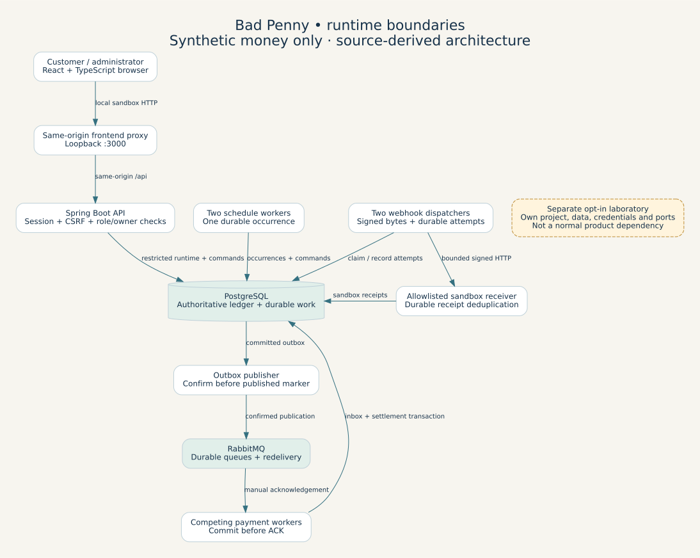
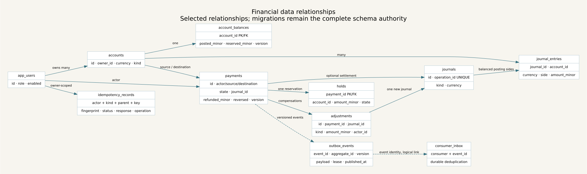
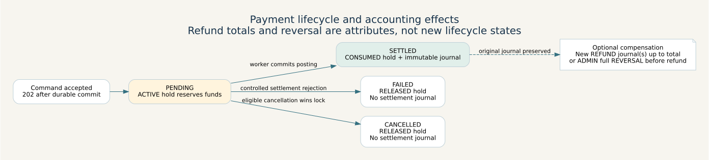
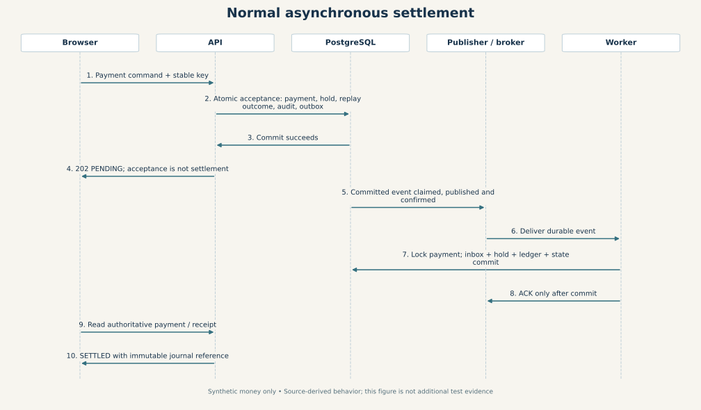
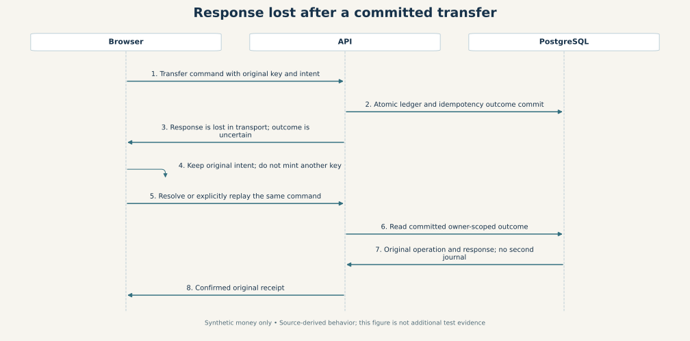
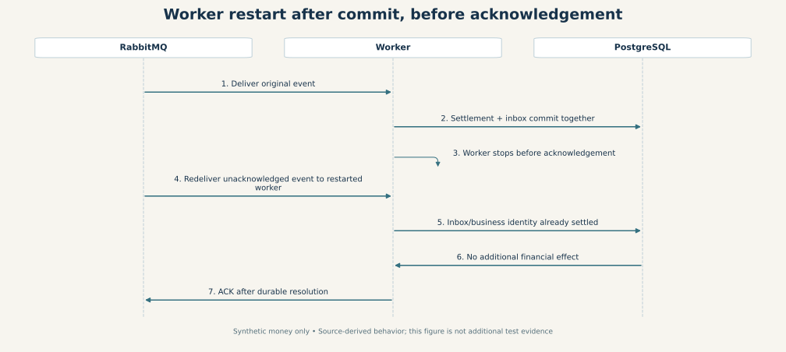
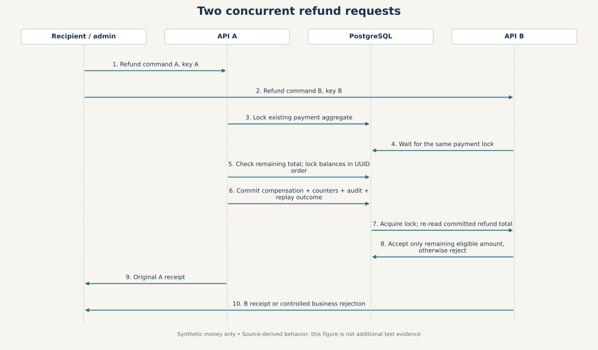

# Architecture and transaction atlas

These figures are source-derived explanations, not additional test executions.
All money is synthetic. Product P01–P08F evidence is linked in the
[reviewer guide](../PORTFOLIO.md); the full release remains NO_GO.

## Runtime architecture

The product is a modular application with independently restartable API, worker,
scheduler and dispatcher roles. The opt-in laboratory uses separate topology and
data. The ordinary product does not require its control services.

## Financial relationships

Solid links show selected persisted relationships; dashed links are aggregate/event
identity associations, not a claim of SQL foreign keys. This figure does not replace
the complete migration schema. See [chart of accounts and lock boundaries](FINANCIAL_BOUNDARY.md).

## Payment state machine

Refund totals and reversal flags remain attributes of the settled payment; new
compensating journals preserve its original settlement.

## Transaction sequences

### Normal payment settlement

### Response lost after commit

### Worker restart before acknowledgement

### Concurrent refund requests

API A/B denote concurrent request handlers, not an assertion that the default
Compose topology deploys two API servers. Financial locking and updates occur in
the protected PostgreSQL command transaction.

## Reproduce and review

Sources: architecture.dot, financial-er.dot, payment-state.dot and sequences.json
in [diagrams](diagrams). Run `./scripts/render-architecture` with Graphviz, Python
and Matplotlib installed. SVGs are committed; generated PNG review previews remain
in ignored local evidence. The renderer invokes no application, API or experiment.
All seven rendered previews were inspected for readable labels and relationships.
