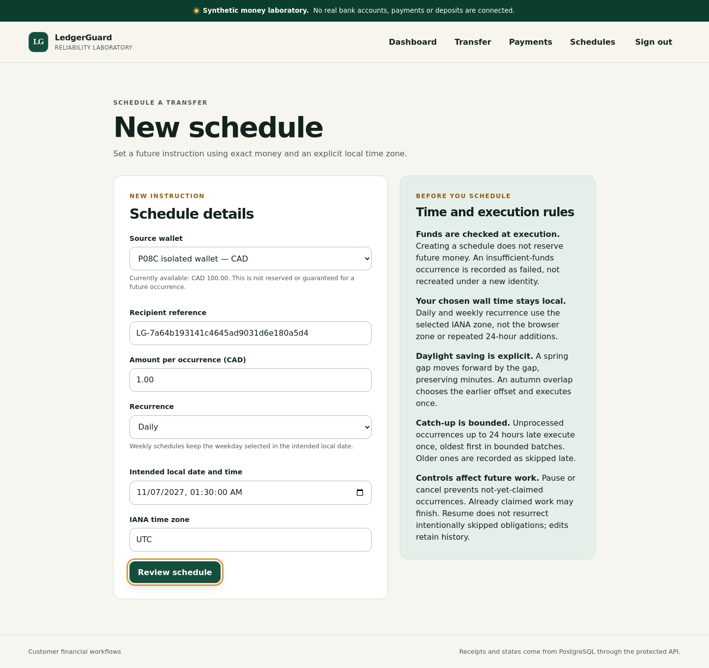
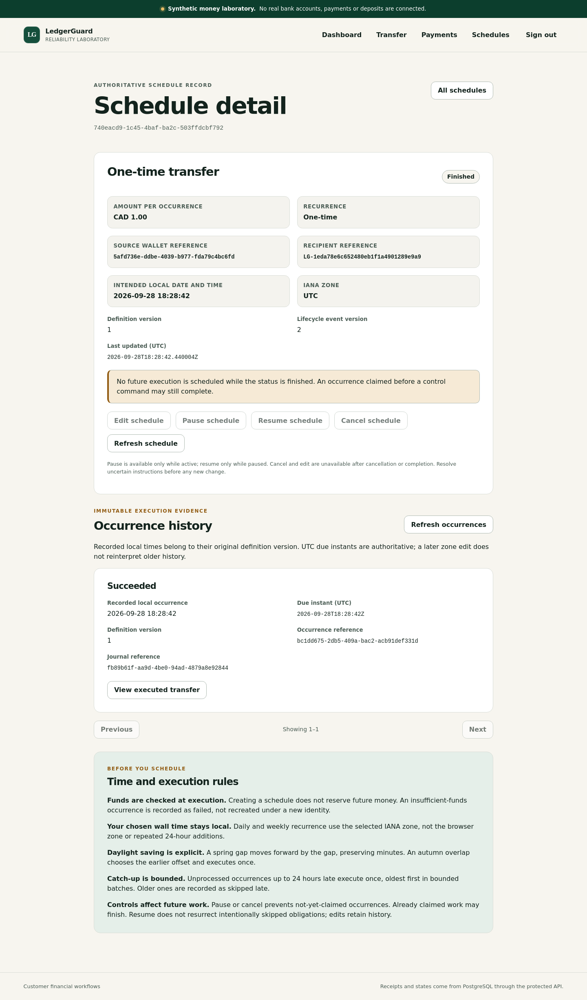
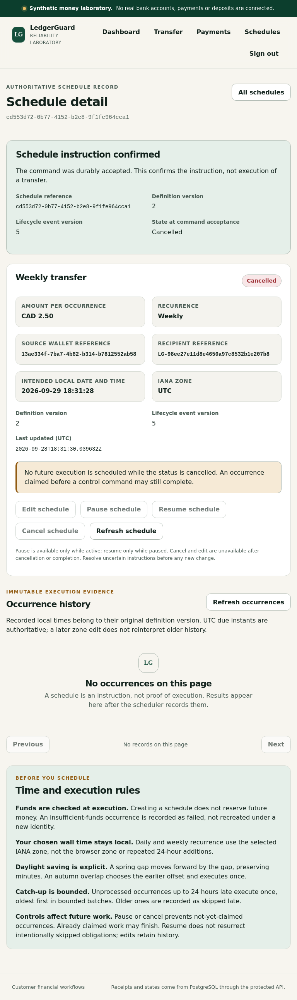
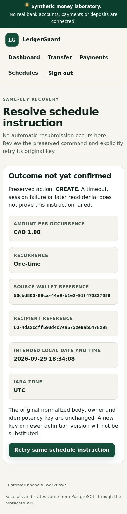

# P08D customer schedule management — VERIFIED_PASS

Synthetic money only. Overall product: **INCOMPLETE / NO_GO**.

## Exact-source verification

- Tested implementation: `13bdd62c924a3230825b6d9304f449f887c8e7fe`.
- Permanent workflow: [run 36464316280](https://github.com/azerish25-ux/transaction-reliability-lab/actions/runs/36464316280), attempt 1, **SUCCESS**.
- Generated gate timestamp: `2026-09-28T18:35:09.097340+00:00`.
- Tracked source tree: clean. Functional browser retries: zero.
- `109070422456` — Build, customer schedules, browser accessibility, signed webhooks and financial invariants: **SUCCESS**.
- `109076906134` — Required P08D gate: **SUCCESS**.

The source SHA above is the tested implementation, not the later evidence-documentation commit.

## Executed results

| Suite | Tests | Failures | Errors | Skipped |
|---|---:|---:|---:|---:|
| junitUnit | 139 | 0 | 0 | 0 |
| postgresHttpIntegration | 127 | 0 | 0 | 0 |
| typescriptClient | 134 | 0 | 0 | 0 |
| browser | 84 | 0 | 0 | 0 |

P08D includes 25 production-client cases, 6 server-preview unit cases and 30 browser cases: ten named scenarios at desktop, tablet and mobile sizes. Eight requirements map to executed tests. Twelve P08D screenshots were present and hashed by the gate. Counts were read from this run's generated XML/JSON reports, not inferred from a minimum.

The permanent campaign retained the earlier financial, authorization, idempotency, payment/outbox, adjustment, schedule and webhook checks. Its final live-status/reconciliation and complete P01-P08D evidence assertion steps succeeded. The run retains their underlying logs and raw evidence.

## Delivered behavior

Owner-scoped schedule lists, creation, version-aware editing, pause/resume/cancel, paged immutable occurrences and real operation/journal references. One-time/daily/weekly recurrence uses explicit local wall time and IANA zone. The server resolves Halifax spring gaps, autumn overlaps and UTC previews without mutation. Funds are checked at occurrence execution, not reserved at creation.

POST and PUT mutations preserve the original normalized intent, owner, key and expected definition version across response loss, reload and reauthentication. Stale edits are rejected rather than silently rewritten. Historical occurrence times retain their original definition meaning after a zone edit.

## Failure found and corrected

Candidate `cf9fa393781c082c83eb630bb304d61f51048c7a`, run `36452807973`, failed `P08DE2E07` at all three viewport sizes: closing the asynchronous preview did not return focus to **Review schedule**. The form temporarily disabled the invoking control, so capturing `document.activeElement` only when the dialog opened lost the trigger.

The corrected dialog accepts an explicit stable return-focus ref. Other callers retain automatic restoration. The Escape assertion remains; the regression additionally reopens the dialog using Enter and checks focus restoration after Go back. These assertions passed in the exact-source campaign above. No financial or accessibility assertions were removed.

## Durable visual evidence

These unmodified screenshots came from the successful run and matched its generated screenshot hashes. They depict historical synthetic fixtures, not current customer records.

## Artifact provenance and limits

Artifact `10989063634`: `ledgerguard-p08d-evidence-13bdd62c924a3230825b6d9304f449f887c8e7fe`; 6434488 bytes. GitHub digest: `sha256:7a4f2458e4e81e238332137aecc0e07452f5a3616b2c4cfb865602e94d4b672a`. The downloaded ZIP matched that digest. Reported expiry: `2026-10-12T18:35:12Z`. Raw evidence remains in the finite-retention Actions artifact; the [JSON provenance](p08d-13bdd62.json), [requirement matrix](p08d-13bdd62/requirements-matrix.md) and four screenshots remain in git.

This is a verified development milestone, not full completion or production financial readiness. Customer webhook and broader administrator interfaces remain before P09. Later test lanes and final release evidence remain open. The secret scan is not a claim that the dependency audit is clean.
