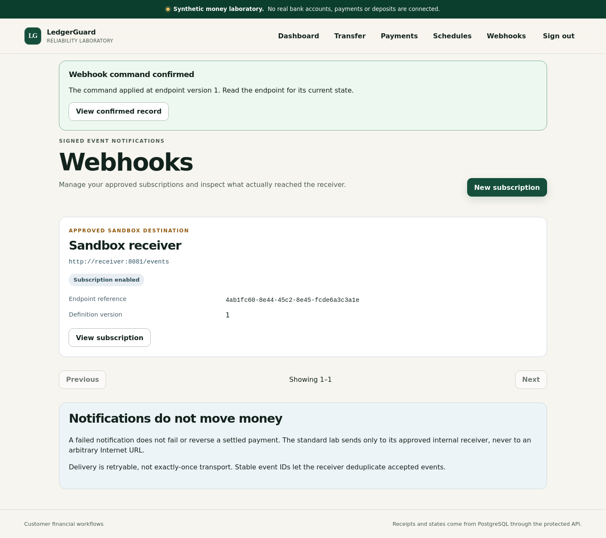
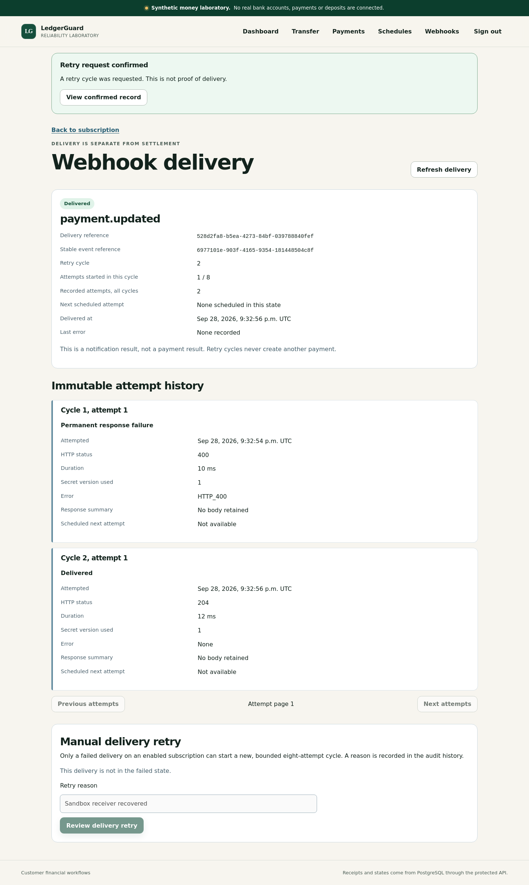
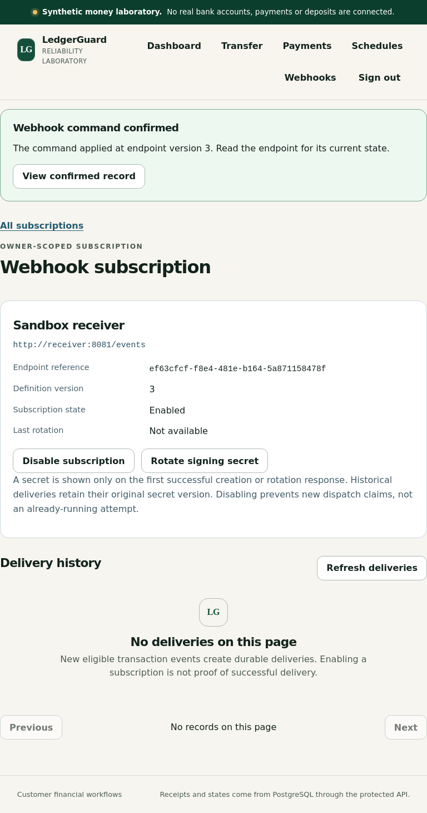
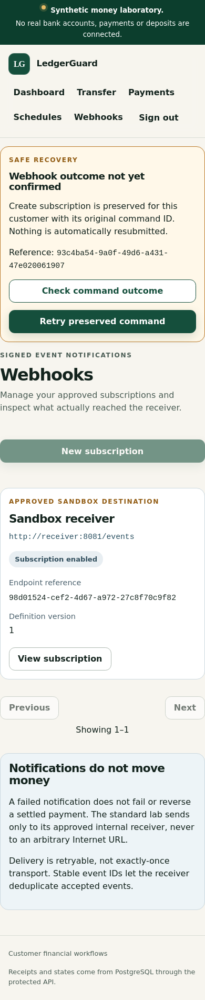

# P08E customer webhooks — VERIFIED_PASS

Synthetic money only. Overall product: **INCOMPLETE / NO_GO**.

## Exact-source verification

Tested implementation: `026dca3ec4c3c68696e87f8192872a4d2e45e157`. Permanent workflow [run 36485630387](https://github.com/azerish25-ux/transaction-reliability-lab/actions/runs/36485630387), attempt 1: **SUCCESS**, including **Required P08E gate**. Tracked source was clean and functional browser retries were zero. This report records the tested implementation separately from later documentation commits.

## Executed results

| Suite | Tests | Failures | Errors | Skipped |
|---|---:|---:|---:|---:|
| JUnit unit | 147 | 0 | 0 | 0 |
| PostgreSQL/HTTP integration | 127 | 0 | 0 | 0 |
| TypeScript client | 162 | 0 | 0 | 0 |
| Browser | 114 | 0 | 0 | 0 |

P08E adds 28 production-client cases, eight JUnit command-validation cases, and 30 responsive browser cases (ten named scenarios at three viewports). Seven requirements map to executed tests. Twelve P08E screenshots passed the gate and their hashes were checked during handoff. Counts above came from generated XML, not inferred minimums. The full P01–P08D campaign, live service checks and final independent reconciliation passed.

## Delivered behavior

Customer-owned approved subscriptions, versioned enable/disable and secret rotation, owner-scoped delivery and immutable attempt inspection, bounded refresh and audited retry. Protected command receipts retain the original owner, command identity, normalized request and applied version/cycle in one PostgreSQL transaction. Committed-response-loss recovery survives reload and reauthentication without a second rotation or another retry cycle. Replays and ordinary reads never redisclose a signing secret.

One-time secret display is transient. Losing its response requires resolving the original command and then deliberately requesting a new rotation if a usable secret is needed. Notifications remain separate from payment settlement; real SQL/browser tests prove retry behavior does not change settled money. Legacy P07B compatibility and financial paths remain intact.

## Verification corrections

Strict browser TypeScript checks found two unchecked fixture array indexes; explicit guards corrected them. Additive V11 exposed an old ten-migration assumption. Integration and live-smoke checks now explicitly require all original ten migrations plus V11. No secret, ownership, delivery or accounting assertion was removed. The run retains its raw test diagnostics and scope.

## Durable responsive evidence

These unmodified images came from the successful run and matched its recorded hashes. They show synthetic fixtures without a signing-secret display.

## Provenance and limitations

Artifact `10999353352`: `ledgerguard-p08e-evidence-026dca3ec4c3c68696e87f8192872a4d2e45e157`; 8558969 bytes. GitHub digest: `sha256:67f84be6e717bee17e32652473893fa5fe20b689b35e5ad2020427c39ac80330`. The downloaded ZIP matched that digest. Reported expiry: `2026-10-12T21:39:11Z`. [JSON provenance](p08e-026dca3.json) and [requirement matrix](p08e-026dca3/requirements-matrix.md) retain source and artifact metadata.

This is a verified development milestone, not full completion or production-financial readiness. Broader administrator interfaces remain before P09. P09–P11, final performance/security/restore campaigns and final release evidence remain open. A source secret scan is not comprehensive security assurance.
