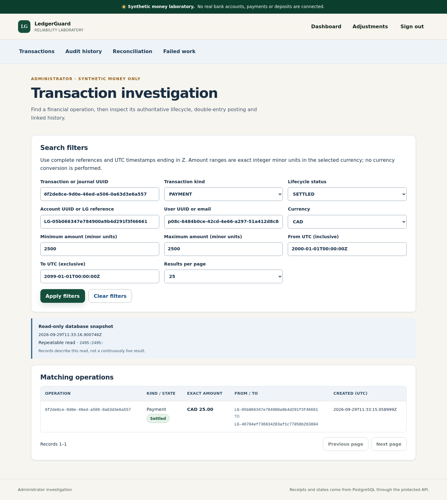
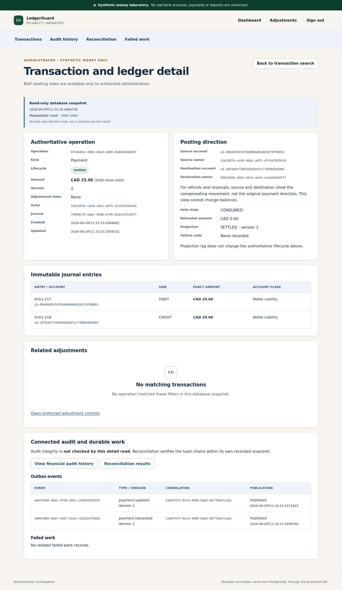
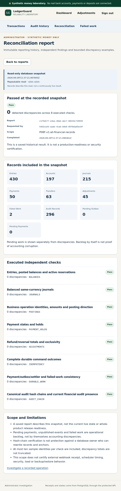
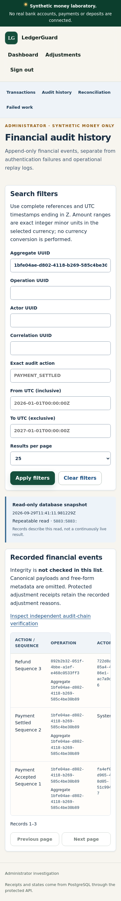

# P08F administrator investigation — VERIFIED_PASS

Synthetic money only. Overall product: **INCOMPLETE / NO_GO**.

## Exact-source verification

Tested implementation: `6331caadd8a5dae0191150c569f767b586d3e1df`. Permanent [run 36561276857](https://github.com/azerish25-ux/transaction-reliability-lab/actions/runs/36561276857), attempt 1, completed successfully including **Required P08F gate**. The tracked source tree was clean. Functional browser retries were disabled. This report does not attribute that execution to a later documentation commit.

## Executed results

| Suite | Tests | Failures | Errors | Skipped |
|---|---:|---:|---:|---:|
| JUnit unit | 159 | 0 | 0 | 0 |
| PostgreSQL/HTTP integration | 140 | 0 | 0 | 0 |
| TypeScript client | 186 | 0 | 0 | 0 |
| Browser | 147 | 0 | 0 | 0 |

Counts were independently aggregated from the generated XML. Thirty new administrator browser cases cover ten scenarios at desktop, tablet and mobile widths. Seven scoped requirements passed, and fifteen responsive screenshot hashes were verified. The full P01-P08E regression campaign and final reconciliation passed.

## Delivered behavior

Server-authorized, bounded transaction filtering; connected immutable journal, adjustment, event and failed-work detail; safe financial audit history; eight independent read-only reconciliation categories in a repeatable-read database snapshot; immutable saved report history and same-ID response-loss recovery across reload and reauthentication; existing failed-work replay with explicit confirmation. No balance editor, audit edit API or automatic discrepancy repair was added.

Real PostgreSQL/HTTP checks cover ownership, CSRF, exact monetary strings, stable pagination, concurrent snapshot behavior, duplicate report identity, tamper detection/restoration and protected runtime roles. Browser/SQL oracles cover actual record relationships, historical report immutability, response loss and failed-work replay. Audit list/detail reads explicitly say NOT_CHECKED; hash verification occurs in the scoped reconciliation.

## Review corrections

The source publication encountered a GitHub internal server error; candidate preservation and a bounded transient retry resolved delivery without a force push. Source review also found lexicographic version ordering: event and audit queries now order by qualified numeric columns, with an additional fourteen-version PostgreSQL/HTTP regression.

## Retained responsive evidence

The following unmodified images came from the successful run and matched its recorded hashes. They contain synthetic fixtures. Hash validation is distinct from visual inspection.

## Provenance and remaining work

Artifact `11029934514`: `ledgerguard-p08f-evidence-6331caadd8a5dae0191150c569f767b586d3e1df`, 12224894 bytes; digest `sha256:3f4c14782ebd6b60c34160a1d7ff9c9e646b15eb31ba09f6ff9ab638cf22ebf1`. The downloaded ZIP matched the digest. Reported expiry: `2026-10-13T11:41:45Z`. [JSON provenance](p08f-6331caa.json) and [requirement matrix](p08f-6331caa/requirements-matrix.md) retain identifiers and scope.

P09 isolated faults and seeded defects are next. P10 contracts/security/performance/restore and complete CI lanes, and P11 final evidence/video/release work remain open. No public deployment, full-product release, whole-product accessibility conformance or production-financial certification is claimed.
