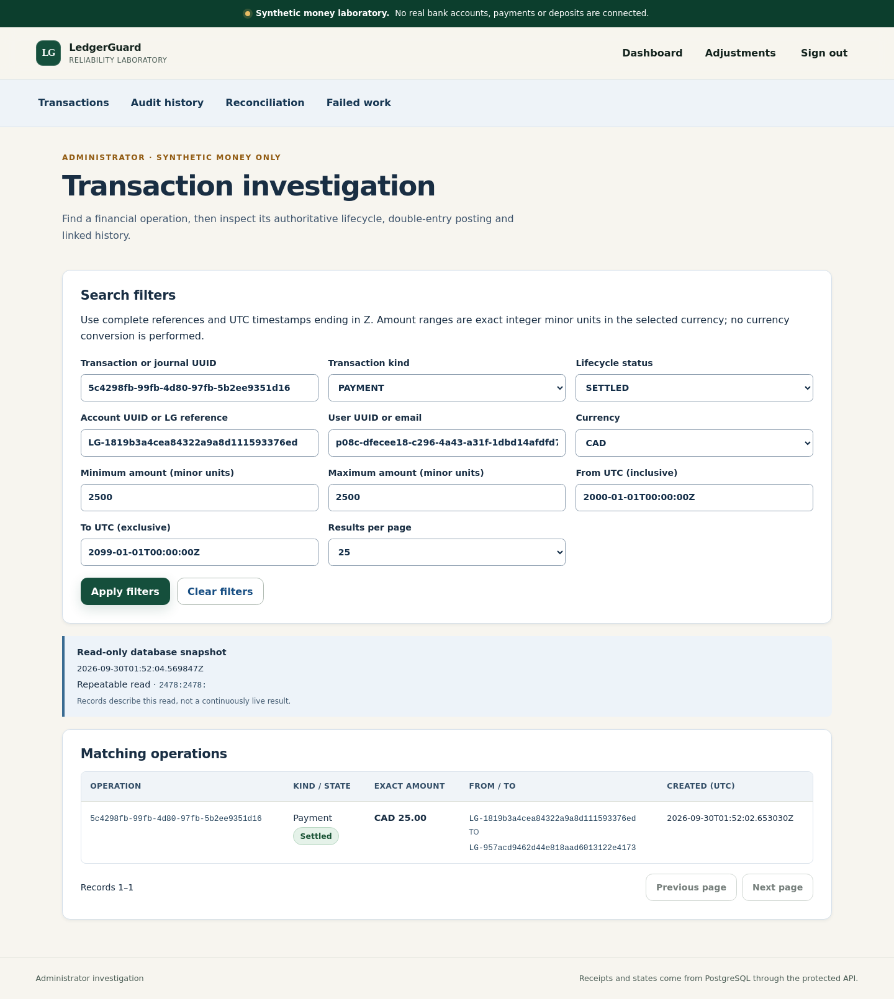
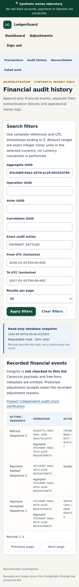

# Verified product campaign on d8d3656

Synthetic money only. Full project: **INCOMPLETE / NO_GO**.

Tested source: `d8d365690d961580d22105feb15ddec3267185ae`, clean tracked tree.
[Product job 109700516992](https://github.com/azerish25-ux/transaction-reliability-lab/actions/runs/36656046918/job/109700516992)
and Required P08F gate passed. The same workflow's isolated laboratory and P09A
gate failed; this is **not** an overall workflow-success claim.

| Executed suite | Tests | Failures | Errors | Skips |
|---|---:|---:|---:|---:|
| Java unit | 165 | 0 | 0 | 0 |
| PostgreSQL / HTTP integration | 140 | 0 | 0 | 0 |
| TypeScript client | 186 | 0 | 0 | 0 |
| Browser | 147 | 0 | 0 | 0 |

Counts were independently aggregated from the original JUnit XML. The archived
product report marks P08F VERIFIED_PASS and the full project INCOMPLETE_NO_GO.
The artifact ZIP's SHA-256 matched GitHub's published digest. Its retention ends
October 14, 2026; this summary and selected unmodified images are durable Git files.
[Machine-readable provenance](product-d8d3656/provenance.json).

## Representative real screenshots

Static visual review found readable desktop filters, clear sandbox labeling and
wrapped mobile navigation. Mobile audit history uses a contained scrollable table;
this is not full accessibility certification. Historical LedgerGuard branding in
the screenshots is preserved. These are actual images from the recorded run,
not a new interactive session or screenshots of the later UI-test repair.

## Subsequent changes

The later [run-identity observation repair](ui-run-identity.md) has eight passing
component regressions plus frontend verification. Its real-browser check and the
full isolated campaign were not rerun. No older pass is attributed to that patch.
